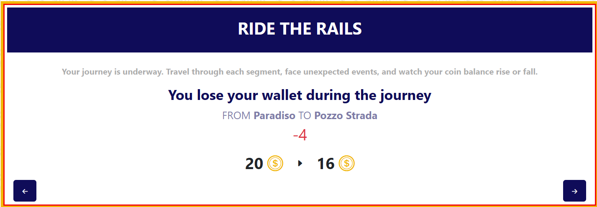
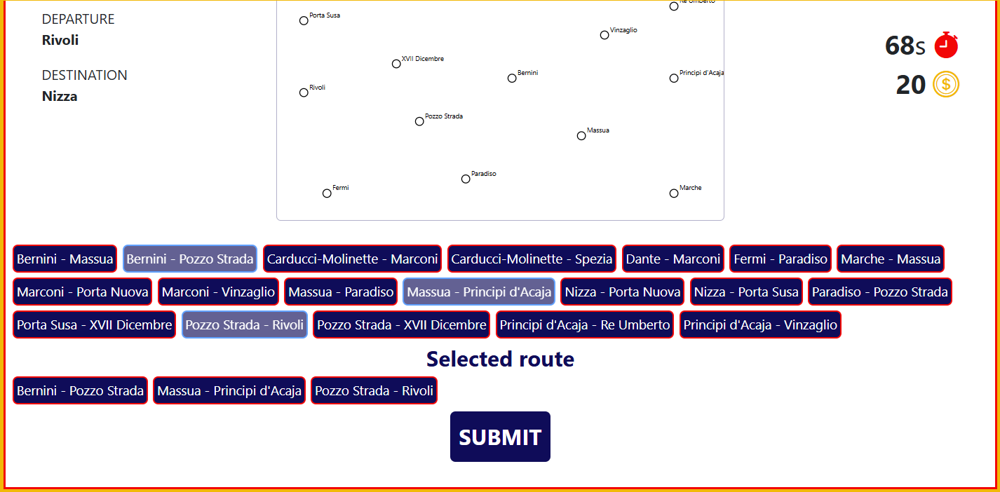
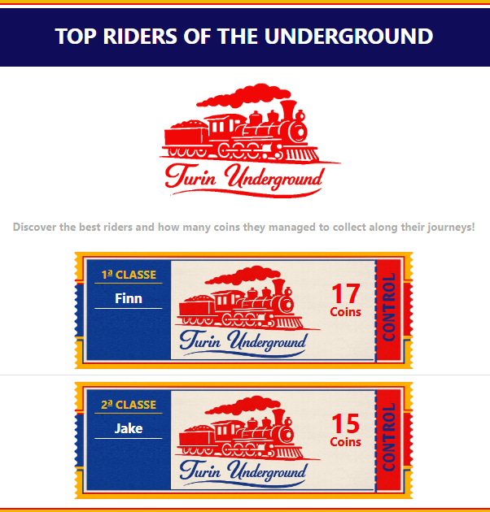

# Exam #1: "Last Race"
## Student: s349557 Roffinella Andrea 

## React Client Application Routes

- Route `/`: welcome page presenting the game platform and the main parts of the website and their links:
  - brief description.
  - instructions page link.
  - login button which displays a pop-up form.
  - game page and ranking page links for registred users.
- Route `/instructions`: contains the rules of the game. It is useful to make the game experience more easy and cover specific aspects to start as a new user.
- Route `/game`: it contains the interactive network map. It is used to start a new game, interact with segments, see the random events and compute the final score.
- Route `/ranking`: it is dedicated to the best score of the platform games. Useful to introduce competition between different users.
- Route `*`: the content alerts about an unexpected URL, it is used to redirect any invalid URL.


## API Server
- POST `/api/sessions`
  - Manages user login
  - request body content
    ```json
    {
      'username': ..,
      'password': ..
    }
    ```
  - response body content
    ```json
    {
      'id': ..,
      'username': ..
    }
    ```
  - Status codes: `201 Created`, `422 Unprocessable Entity`, `500 Internal Server Error`
  - Authentication required: false
- DELETE `/api/sessions/current`
  - Ends current session
  - no request/response body content and parameters
  - Status codes: `200 OK`
  - Authentication required: false
- GET `/api/sessions/current`
  - Retrieves data of a session logged used
  - no request body content and parameters
  - response body content
    ```json
    {
      'id': ..,
      'username': ..
    }
    ```
  - Status codes: `200 OK`, `401 Unauthorized`
  - Authentication required: true
- GET `/api/ranking`
  - Returns the global ranking of top 20 players
  - no request body content and parameters
  - response body content 
    ```json
    [
      {
        'username': ..,
        'bestScore': ..
      },
      {...}
    ]
    ```
  - Status codes: `200 OK`, `401 Unauthorized`, `500 Internal Server Error`
  - Authentication required: true
- GET `/api/network`
  - Returns the complete structure of the underground
  - no request body content and parameters
  - response body content 
    ```json 
    {
      'lines': [
        {
          'id': ..,
          'name': ..,
          'color': ..
        },
        {...}
      ],
      'stations': [
        {
          'id': ..,
          'name': ..,
          'positionX': ..,
          'positionY: ..
        },
        {...}
      ],
      'segments': [
        {
          'id': ..,
          'stationIds': [id_1, id_2],
          'lineId: ..
        },
        {...}
      ]
    }
    ``` 
  - Status codes: `200 OK`, `401 Unauthorized`
  - Authentication required: true
- GET `/api/games/current`
  - Checks if an active game exists (within the 95 second server tolerance)
  - no request body content and parameters
  - response body content 
    ```json 
    {
      'active': true,
      'startStationId': ...,
      'destinationStationId': ...,
      'startTime': '2026-06-07 10:30:00'
    }
    ```  
    or
    ``` json
    {
      'active': false
    } 
    ``` 
  - Status codes: `200 OK`, `401 Unauthorized`, `500 Internal Server Error` 
  - Authentication required: true
- POST `/api/games`
  - Returns a new game randomly generating start and destinations nodes at least 3 stops apart
  - no request body content and parameters
  - response body content 
    ```json 
    {
      'active': true,
      'startStationId': ...,
      'destinationStationId': ...,
      'startTime': '2026-06-07 10:35:00',
    }
    ``` 
  - Status codes: `201 Created`, `401 Unauthorized`, `409 Conflict`, `500 Internal Server Error` 
  - Authentication required: true
- POST `/api/games/route`
  - The user sends the route and the server responds with the outcome of the game
  - request body content 
    ```json 
    {
      'route': [firstSegmentId, ..., lastSegmentId],
    }
    ```
  - response body content
    ```json
    {
      'events': [{
        'description': ..,
        'effect': ..
      }],
      'score': ..,
      'status': ..,
      'validationErrors': {
        'route': ..
      },
    }
    ```
    or
    ```json
    {
      error: ..
    }
    ```
  - Status codes: `200 OK`, `404 Not Found` for an expired game, `401 Unauthorized`, `409 Conflict` for an already completed game, `422 Unprocessable Entity` for an invalid route, `500 Internal Server Error`
  - Authentication required: true


## Database Tables

- Table `users` - id, username, hashedPassword, salt
- Table `stations` - id, name, positionX, positionY
- Table `lines` - id, name, color
- Table `segments` - id, firstStationId, secondStationId, lineId
- Table `events` - id, description, effect
- Table `games` - id, userId, startStationId, destinationStationId, startTime, score, status

## Main React Components

- `App` (in `App.jsx`): It manages the global user state (via `UserContext`), handles session checks at launch, centralizes login/logout actions, and manages the client routing structure.
- `BaseLayout` (in `App.jsx`): The structural shell component. It uses global structural elements like the `Header`, the sidebar `NavigationRail`, and the main page content layout (`<Outlet />`).
- `LoginModal` (in `Login.jsx`): A controlled modal window for user authentication. It manages field inputs, sanitizes usernames and triggers backend validation to highlight wrong fields inline.
- `NavigationRail` (in `NavigationRail.jsx`): The vertical sidebar navigation. It provides link-switching between views based on the context user state, revealing rankings or  game pages once authenticated.
- `RankingList` (in `RankingList.jsx`): The leaderboard data loader. It uses backend APIs to fetch global statistics and structures them into sequential ranks via custom `RankingItem` components.
- `GameLayout` (in `App.jsx`): The core gameplay state machine. It orchestrates the entire game lifecycle by managing four distinct phases (`setup`, `planning`, `execution`, and `result`). It acts as a smart container that handles asynchronous data fetching (retrieving the underground network structure and checking for pre-existing active sessions), handles game initialization, and submits the finalized player route to the server while managing loading spinners and network error states.
- `SetupView` (in `GameViews.jsx`): The pre-game phase interface. It displays a static visualization of the entire underground network using an interactive SVG map (`NetworkMap`).
- `PlanningView` (in `GameViews.jsx`): The primary gameplay interface. It forces players to choose interconnecting line segments within a fixed 90-second countdown (`Timer`) to reconstruct a valid pathway connecting their assigned departure and destination.
- `ExecutionView` (in `GameViews.jsx`): It maps out sequential route directions and relies on an internal loop slider (`EventsSlider`) to animate underground random events and compute incremental coin variations.
- `ResultView` (in `GameViews.jsx`): Shows invalid routing anomalies (`routeError`) and displays final accumulated coin rewards.
- `NetworkMap` (in `GameViews.jsx`): Map rendering through an svg the entire underground network.

## Screenshot





## Users Credentials

- Finn, password1
- Jake, password2
- BMO, password3

## Use of AI Tools
During development, I used ChatGPT and Gemini mainly for debugging, solving doubts, getting feedback on my development ideas and for text content and graphic suggestions with preview images.